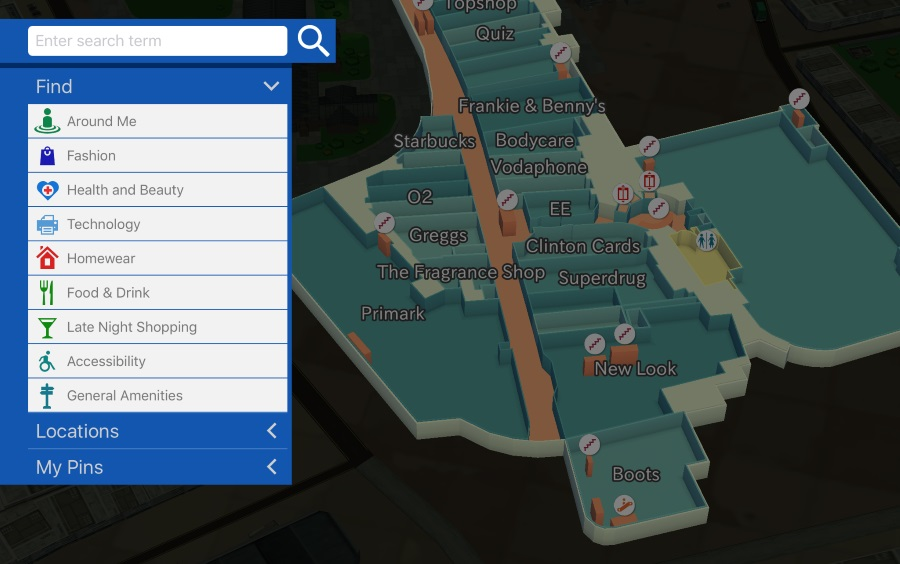

eeGeo Map Scene REST API v1.1
==================

This document describes version 1.0 of the eeGeo Map Scene REST API for submitting and managing custom 3D maps. The Map Scene API is primarily intended for use with [eegeo-example-app](http://github.com/eegeo/eegeo-example-app).

Map Scenes allow the configuration of [eegeo-example-app](http://github.com/eegeo/eegeo-example-app) without the need to change code, or deploy a new iOS or Android app.

---

## Quick Start

1. Obtain a Developer Authentication Token by signing up at [https://www.eegeo.com/developers/](https://www.eegeo.com/developers/)
2. Create an Application API Key at [https://www.eegeo.com/developers/](https://www.eegeo.com/developers/)
3. [Create a new Map Scene](#newmapscene)
4. [Access the Map Scene Short Link](#shortlink)

---

Full Map Scene API Specification
==========================

#### Authentication Token

Obtain a Developer Authentication Token by signing up at [https://www.eegeo.com/developers/](https://www.eegeo.com/developers/). The Developer Authentication Token allows you to make authenticated requests against the POI service.

The Authentication Token will be referred to as ```dev_auth_token``` throughout this README

#### Application API Key

The Application API Key is the API key used to authenticate the eeGeo SDK. Application Keys can be associated with POI sets, providing that application access to the POI set. Obtain Application API keys from [https://www.eegeo.com/developers/](https://www.eegeo.com/developers/).

Application API Keys will be referred to as ```app_api_key``` throughout this README

#### MapScene

A Map Scene is a subset of the [eegeo-example-app](http://github.com/eegeo/eegeo-example-app) [configuration file](https://github.com/eegeo/eegeo-example-app/blob/master/ios/Resources/ApplicationConfigs/standard_config.json). It allows the configuration of [eegeo-example-app](http://github.com/eegeo/eegeo-example-app) and [maps.eegeo.com](http://maps.eegeo.com) without the need to write code, or deploy apps.

A Map Scene is a JSON object with the following attributes:

|Field|Type|Description|
 --- | --- | ---
|`id`|integer| a unique identifier for the map scene, this is generated for you
|`name`|string| an appropriate name for the map scene, this is displayed in the 'about page' of the map
|`eegeo_api_key`|string| the app_api_key to use
|`start_location_latitude`|decimal| (optional) the WGS84 decimal degrees latitude of the camera's starting point of interest
|`start_location_longitude`|decimal| (optional) the WGS84 decimal degrees longitude of the camera's starting point of interest
|`start_location_altitude`|decimal| (optional) the AMSL in metres of the camera's starting point of interest
|`start_location_orientation_degrees`|decimal| (optional) the heading from north of the camera orientation in degrees
|`try_start_at_gps_location`|boolean| (optional) whether the map should attempt to go to the gps location initially
|`coveragetree_manifest_url`|string| (optional) url to an eegeo coverage tree
|`web_coveragetree_manifest_url`|string| (optional) url to an eegeo web coverage tree
|`theme_manifest_url`|string| (optional) url to an eegeo theme
|`outdoor_search_menu_items`|array| (optional) an array of SearchMenuItems to configure the search taxonomy used in the map

A SearchMenuItem is a JSON object with the following attributes:

|Field|Type|Description|
 --- | --- | ---
|`name`|string| the human readable display name
|`search_tag`|string| the eegeo tag to search for
|`icon_key`|string| the icon to use
|`skip_yelp_search`|bool| (optional) set to true to disable yelp search functionality
|`yelp_mapping`|string| (optional) the yelp category to search for

The default set of search tags can be found here: https://cdn1.eegeo.com/eegeo-search/latest/tags/search_tags.json

The default set of icons can be found here: https://cdn1.eegeo.com/eegeo-search/latest/assets/ios/icons.json

##### <a name="newmapscene"></a>Create a new Map Scene

To create a new Map Scene, make a RESTful request passing the Map Scene object

```sh
$ curl -v -XPOST https://eegeo.mp/v1.0/mapscenes/?token=dev_auth_token -d '{
   "name":"Westport House",
   "start_location_latitude":"56.459984",
   "start_location_longitude":"-2.978228",
   "start_location_altitude":"2.7",
   "start_location_distance":"1781.0",
   "start_location_orientation_degrees":"0.0",
   "try_start_at_gps_location":false,
   "eegeo_api_key":"<my_api_key>",
   "outdoor_search_menu_items_attributes":[
    {
         "name":"Offices",
         "search_tag":"office",
         "icon_key":"office"
    }
   ]
}'
```

The response will be a JSON object specifying the newly created Map Scene:

```json
{
   "name":"Westport House",
   "start_location_latitude":"56.459984",
   "start_location_longitude":"-2.978228",
   "start_location_altitude":"2.7",
   "start_location_distance":"1781.0",
   "start_location_orientation_degrees":"0.0",
   "try_start_at_gps_location":false,
   "eegeo_api_key":"<my_api_key>",
   "outdoor_search_menu_items_attributes":[
    {
         "name":"Offices",
         "search_tag":"office",
         "icon_key":"office"
    }
   ],
   "id":1,
   "short_link":"abcdef"
}
```

Make note of the short_link, in this case ```abcdef``` as this is used to access the Map Scene

##### Get all Map Scenes

All Map Scenes you own can be listed by making a RESTful request to the mapscenes resource:

```
$ curl -v https://eegeo.mp/v1.0/mapscenes/?token=<dev_auth_token>
```

This will return a collection of all Map Scenes you own

##### Query a Map Scene

To query an individual Map Scene, make a RESTful request to the Map Scene:

```
$ curl -v https://eegeo.mp/v1.0/mapscenes/<MID>?token=<dev_auth_token>
```

Where ```<MID>``` is the Map Scene ID to query. This will return the Map Scene as JSON.

##### Edit a Map Scene

To edit an existing Map Scene, make a RESTful request passing the changes to the Map Scene. For example, to change the name and starting location of the MapScene:

```
$ curl -v -XPUT https://eegeo.mp/v1.0/mapscenes/<MID>?token=<dev_auth_token> -d '{
   "name":"Updated Name",
   "start_location_latitude":"47.459984",
   "start_location_longitude":"12.978228"
}'
```

The response will be a JSON object specifying the updated Map Scene.

To change the SearchMenuItems in the menu, you must pass the entire model of the menu.  For example, if you add one you must include the original as well:

```
$ curl -v -XPUT https://eegeo.mp/v1.0/mapscenes/<MID>?token=<dev_auth_token> -d '{
    "outdoor_search_menu_items_attributes":[
    {
         "name":"Offices",
         "search_tag":"office",
         "icon_key":"office"
    },
    {
         "name":"Hotels",
         "search_tag":"hotel",
         "icon_key":"hotel"
    }
   ]
}'
```

##### Delete a Map Scene

To delete a Map Scene, make a RESTful request to the poiset:
```
$ curl -v -XDELETE https://eegeo.mp/v1.0/mapscenes/<MID>?token=<dev_auth_token>
```
Where ```<MID>``` is the Map Scene ID to delete.

##### <a name="shortlink"></a>Access the Map Scene Short Link

The ```short_link``` of a Map Scene is used to access the map scene

```
$ curl -v https://eegeo.mp/<short_link>
```

Requests to `https://eegeo.mp/<short_link>` redirect the agent to:
* maps.eegeo.com if on browser
* eegeo:// deep links, for use with [eegeo-example-app](http://github.com/eegeo/eegeo-example-app) if on iOS or Android

#### Disclaimer
This is an early version of the Map Scene API.  eeGeo Ltd reserves the right to make changes to the API and its documentation at any time.  

---

#### Contact us
If you have any problems or queries please [raise an issue](https://github.com/eegeo/mapscene-api/issues/new).
